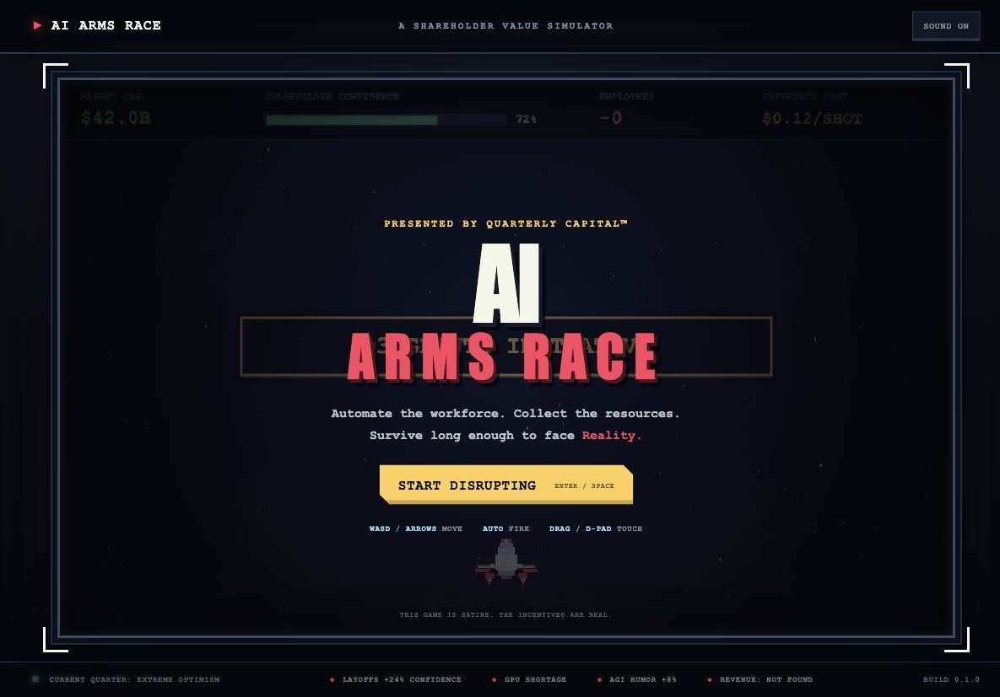
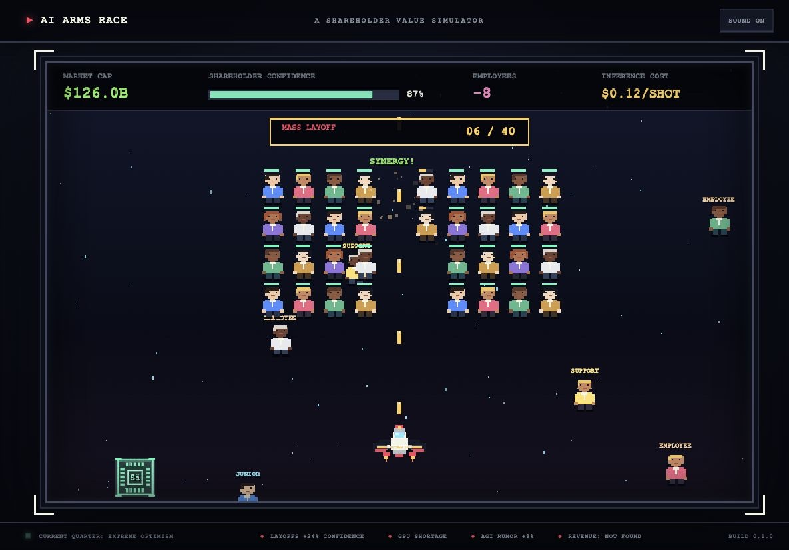

# AI Arms Race

A retro arcade satire about AI hype, layoffs, limitless funding, and the final
boss: Reality.

You play as Big Tech. Automate the workforce, collect GPUs, silicon, RAM,
cooling water, rare earths, and VC funding, then survive long enough to face
the one thing no hype cycle can avoid.

> This game is satire. The incentives are real.

## Screenshots





## Play online

[ai-arms-race-ashy.vercel.app](https://ai-arms-race-ashy.vercel.app)

## Play

- Move with `WASD` or the arrow keys
- On mobile, drag the aircraft to move
- Use `FULLSCREEN` and rotate the phone to fill the display
- Firing is automatic
- Collect resources and layoffs to increase shareholder confidence
- Clear the 40-person mass-layoff formation
- Defeat the Reality carrier-fortress without colliding with its hull
- Survive the final explosion

## Run locally

Requires Node.js 22 or newer.

```bash
npm install
npm run dev
```

Open [http://localhost:3000](http://localhost:3000).

## Production

The game is built with React, Next.js, TypeScript, and the Canvas API. It can be
deployed to Vercel as a standard Next.js application.

## Why this exists

The game exaggerates the incentives around the current AI market: higher
valuations, lower headcount, more compute, more funding, and a business model
that can always be figured out next quarter.
